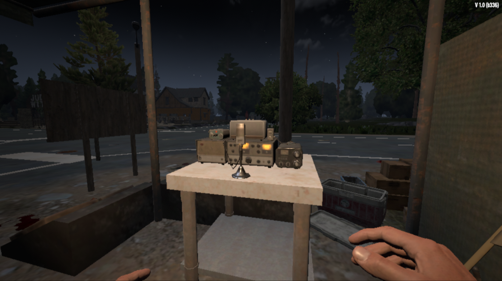

 Radio Researcher
==================================================================================

Use your own items in order to receive a schematic of it with the help of Joel's.

Usage
-----

After acknowledging the Radio Researcher schematic, craft it and put inside your base.<br>
Radio Researcher can also be found on specific POIs and in trader.

Installation
------------

First download the mod's archive. [[ZIP](https://gitlab.com/moredaystodie/radio-researcher/-/archive/master/radio-researcher-master.zip)/[TAR](https://gitlab.com/moredaystodie/radio-researcher/-/archive/master/radio-researcher-master.tar.gz)]

Move the `radio-researcher-master` folder to 7 Days to Die's mod folder.<br>

- Steam:
```shell
SteamLibrary/steamapps/common/7 Days to Die/Mods
```

If there is no `Mods` folder, create one there.

Gallery
-------

<p align="left">
  
  
  
  
  
  
  
  
  
  
</p>

Repositories
------------

- https://gitlab.com/moredaystodie/radio-researcher (master)
- https://github.com/SimplyCEO/MDTD-Radio-Researcher (mirror)

